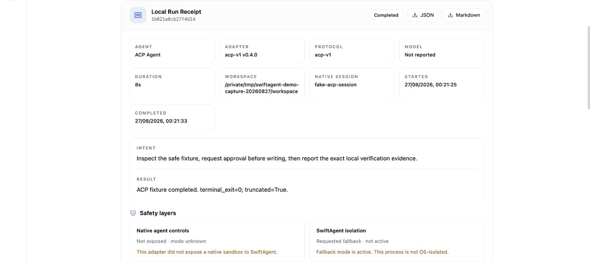
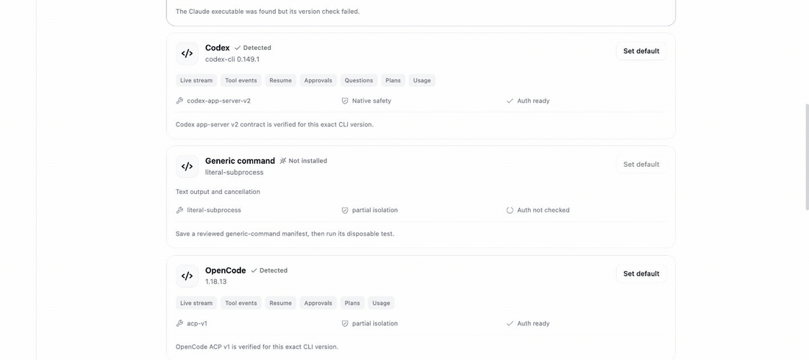

# Reproducible three-agent demo

The Northstar Release Desk demo is a bounded workflow proof, not a model
benchmark. It lets Claude Code, Codex, and OpenCode receive the same harmless
task in separate Git workspaces while SwiftAgent records the capabilities and
evidence each adapter actually exposes.



## What this proves

- Local agent discovery reports readiness, version, protocol, models, auth
  state, and declared capabilities without an inference call.
- Changing the selected agent does not erase the composer draft or workspace.
- Controls for approvals, questions, plans, usage, model discovery, and resume
  follow the selected adapter's capability contract.
- Supported approval events, tool activity, plans, usage, native event types,
  Git evidence, and verification state share one normalized receipt format.
- A cross-agent continuation is a redacted new run, not silent native-session
  sharing.

It does not prove equal model quality, latency, cost, authentication, safety, or
behavior across every CLI release and operating system. Those claims require
separate live evidence.

## 1. Verify the fixture without an agent

```bash
make setup
make demo-verify
```

The verifier copies `demo-workspace/template/` to a temporary directory. It
requires the initial `python3 -m unittest -q` run to fail, applies the repository
reference implementation, and requires the same command to pass. No agent,
provider, package install, or network request is involved.

## 2. Prepare isolated runs

```bash
make demo-prepare
```

This resets three ignored nested Git repositories:

```text
demo-workspace/runs/claude-code
demo-workspace/runs/codex
demo-workspace/runs/opencode
```

The target directory is allowlisted before replacement. Each repository gets a
clean `demo baseline` commit, so the Local Run Receipt can distinguish the
agent's edits from pre-existing changes. Preparing one run is also supported:

```bash
server/.venv/bin/python scripts/demo_workspace.py prepare codex
```

## 3. Run the exact same task

Start SwiftAgent with a dedicated workspace root that contains the repository,
then open `http://127.0.0.1:5173`:

```bash
make dev
```

For each named agent:

1. confirm that its card says detected/ready and review its capability chips;
2. select the matching `demo-workspace/runs/<agent>` directory;
3. paste that directory's `TASK.md` into the composer;
4. leave native approvals enabled when the adapter supports them;
5. review any approval request instead of auto-approving it;
6. wait for a terminal result and inspect the Local Run Receipt;
7. record verification as `passed` only if `python3 -m unittest -q` actually
   exited successfully; and
8. export the receipt before resetting that agent's workspace.

Re-run the preparation command before repeating an agent. Never use resume to
carry one agent's native session into another agent; use the redacted handoff
preview when cross-agent continuation is the scenario under test.

## 4. Protocol-fixture walkthrough



The animation was captured from the real browser UI on 2026-08-27. Local
read-only detection found the pinned Codex `0.149.1` and OpenCode `1.18.13`
contracts. The completed timeline used the repository's deterministic ACP
fixture, including one manually accepted approval, one tool, a plan update,
usage, and a persisted ledger. It made no provider/model call and contains no
credential or personal workspace path.

## Capture hygiene

- Use only a demo data directory and the fictional workspace.
- Keep provider tokens, personal paths, native config files, and real prompts
  outside the frame.
- Show the fallback warning when OS isolation is not active.
- Do not edit screenshots to turn `not run`, `partial`, `unknown`, or
  `unsupported` into a stronger status.
- Label protocol-fixture footage as fixture footage.
- Prefer a short workflow capture over a manufactured side-by-side scorecard.
